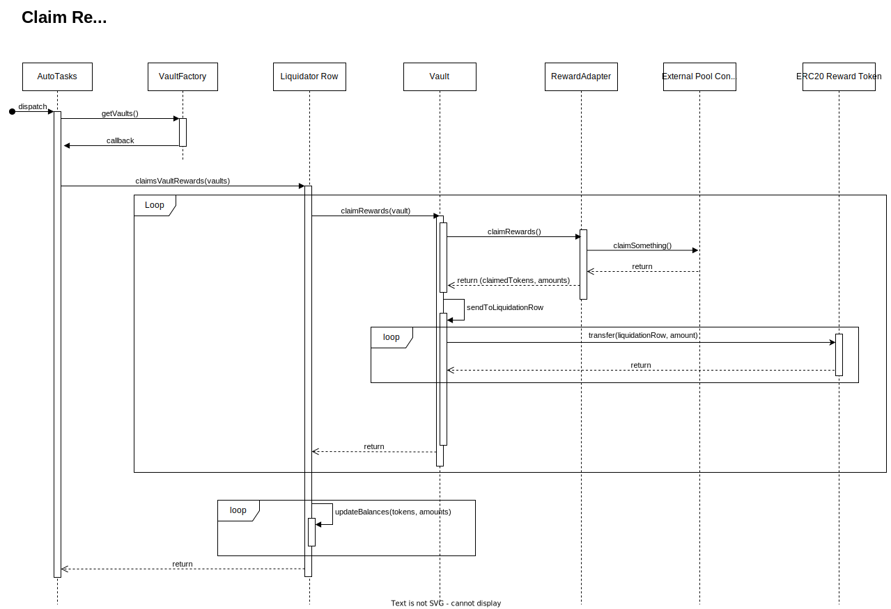

## Claim Rewards

The primary goal of this process is to claim rewards for each Vault. Once rewards are claimed, they are sent to the Liquidator Row contract for subsequent liquidation.

    

### Process

The Autotask cloud function is triggered and performs the following steps:

-   Calls the Liquidator Row contract with the list of Vault addresses.
-   The Liquidator Row contract iterates through each Vault address and calls the collectRewards function and then call the \_increaseBalance function.

For each Vault, the collectRewards function performs the following steps:

-   Calls the RewardAdapter's collectRewards function, which claims the rewards from the external pool contract (e.g., Convex, Curve, or Balancer).
-   For each claimed asset:
    -   Transfers the claimed rewards to the Liquidator Row contract using IERC20(claimedAsset).transfer(liquidatorRow, amount).

After the claiming process, the liquidation process takes place, which converts the claimed assets into a target asset (e.g., WETH) and updates the Vault balances accordingly.

### Components

#### Vaults

Each Vault must implement the IDestinationVault interface and have a collectRewards function that performs the following steps:

-   Call rewardAdapter.collectRewards(...) to claim the rewards from the connected AMM protocol, such as Convex, Curve, or Balancer.
-   For each claimed asset:
    a. Use IERC20(claimedAsset).transfer(liquidatorRow, amount) to transfer the claimed asset to the Liquidator Row contract.

#### Rewards Adapter

This component implements the IClaimableRewardsAdapter interface and serves as a bridge between the main smart contract (like the Vault) and External Pool Contracts. It standardizes the interaction with different AMM protocols and allows the Vault to claim rewards on behalf of users.

#### Liquidator Row

The Liquidator Row contract:

-   acts as an orchestrator for the claiming process. Its primary function is to trigger the collectRewards function for each Vault contract provided in the parameter.
-   is the smart contract responsible for liquidating reward tokens into another asset, such as WETH. After the Vault claims rewards using the RewardAdapter, it transfers the rewards to the Liquidator Row. The Liquidator Row maintains a record of each vault's balances, enabling it to accurately distribute the liquidated assets (e.g., WETH) back to the appropriate vaults in proportion to their respective balances.

---

## Liquidate Rewards

The primary goal of this process is to liquidate rewards for each Vault. Once rewards are claimed and sent to the Liquidator Row contract, they are liquidated into another asset, such as WETH.

Sequence diagram: https://app.diagrams.net/#G1s_vQgDn0cFG4PZSY_pkKUzk31h23Vs6k

### Process

The Autotask cloud function is triggered and performs the following steps:

-   Calls the Liquidator Row contract to get the list of tokens to liquidate.
-   For each token, it calls:
    a. The aggregator API to get the best swap for the given token.
    b. The Liquidator Row contract to liquidate rewards.

The Liquidator Row contract:

-   Calls the Swapper contract to swap the token against the target token (which in turn calls an external aggregator).
-   If fees feature is turned on, send fees to the fee receiver
-   Queues the rewards in the destination vaults rewarder.

### Components

#### Liquidator Row

The Liquidator Row contract acts as an orchestrator for the liquidation process. Its primary function is to trigger the liquidateRewards function for each Vault contract provided in the parameter.

#### Swapper

The Swapper contract is responsible for performing the actual swap of claimed assets into another asset, such as WETH. It interacts with external aggregators to find the best swap route and execute the token swap.
