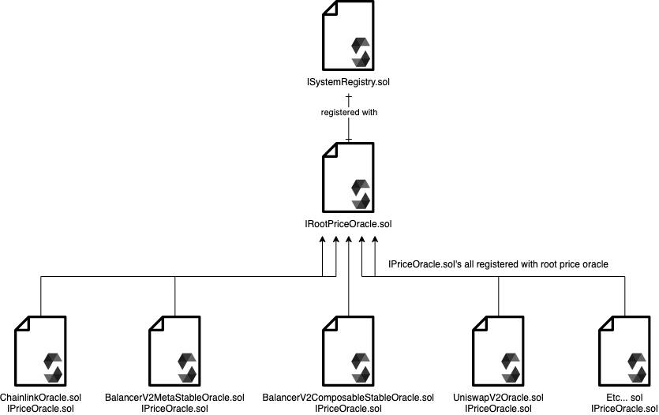
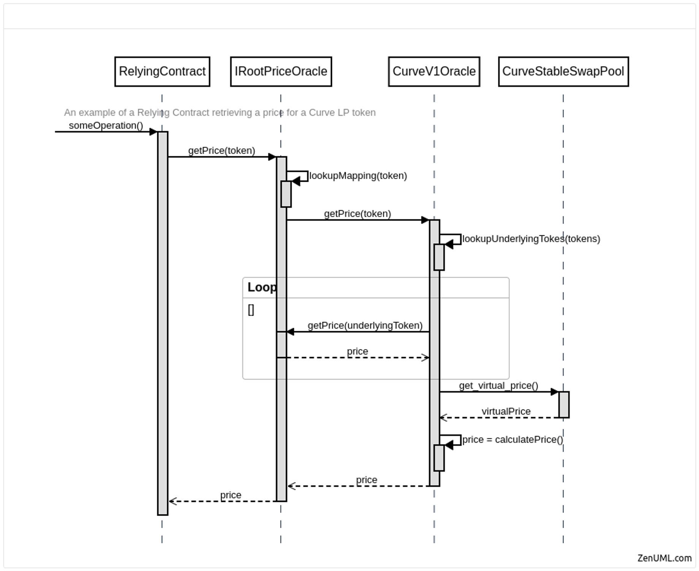

# Tokemak Pricing Docs

Tokemak V2 requires accurate, tamper resistant pricing of assets, both native ERC20 and lp tokens. This collection of contracts is used to accomplish that goal.

## Pricing System Structure

The system instance of `RootPriceOracle.sol` is stored in `SystemRegistry.sol`. All of the `IPriceOracle.sol` contracts are stored with the `RootPriceOracle.sol` contract.

## Call Flow

This diagram shows a typical call flow for a Curve lp token. While the call flow will not follow this exact pattern for every token, and will vary for native ERC20s, LSTs, etc, it is a good guide for how the pricing part of Tokemak V2 works. `getPrice(address token)` in this diagram is `getPriceInEth(address token)` in the current iteration of the contracts.

## Root Price Oracle

This contract acts as the entry point into the pricing part of the Tokemak V2 system. This contract keeps a registry of all tokens to be priced to the `IPriceOracle.sol` contracts that are used to price them. The pricing part of Tokemak V2 should always be accessed through this contract.

Functionalities

-   Register a token to be priced.
-   Replace the `IPriceOracle.sol` instance that is used to price a certain token.
-   Remove the ability of a token to be priced.
-   Get price in Eth of any token registered.

## Native ERC20 Oracles

### `BaseOracleDenominations.sol`

This oracle is used as a base for any external oracle contracts, Tellor and Chainlink as of right now.

Functionalities

-   Handles case where token being priced is returned in USD quote instead of Eth quote.

### `ChainlinkOracle.sol`

Handles getting offchain prices through Chainlink price feeds.

Functionalities

-   Ability to register `IAggregatorV3Interface.sol` oracle contracts for native ERC20 tokens.
-   Ability to remove `IAggregatorV3Interface.sol` oracle contract, removing ability of token to be priced by Chainlink.
-   Returns price of native ERC20 tokens in Eth.

### `TellorOracle.sol`

Handles getting spot pricing from Tellor oracle contracts.

Functionalities

-   Register token for Tellor to price.
-   Remove ability of token to be priced through Tellor.
-   Return price of token in Eth.

## LST Oracles

Contains `SfrxEthOracle.sol`, `SwEthEthOracle.sol`, `WstETHEthOracle.sol`.

All of these oracles operate in a similar way, getting the price of the LST in Eth using a `lstInEth()` function that is a part of the LST token contract. These also may have to get the price of an underlying token (Ex: Pricing WstEth required getting the price of stEth in Eth).

## Eth Oracle

`EthPeggedOracle.sol`. This contract returns `1e18` and is used for token that are pegged 1:1 with Eth.

## Lp Token Oracles

### `BalancerLpComposableStableEthOracle.sol`

This contract is used to price Balancer composable stable pools. It uses a pricing approach developed by Curve, using the minimum price of a token in the pool, multiplying it by the ratio of the pools invariant to BPT tokens. This ratio is the same thing as Curve's virtual price `p = (minPrice * balancerPool.getRate()) / 1e18`.

Functionalities

-   Gets price of a Balancer composable stable pool lp token in Eth. Will revert if the pool is not a Balancer pool.

### `BalancerLPMetaStableEthOracle.sol`

This contract is used to price Balancer metastable pools. This contract uses a variation of the Curve virtual price calculation discussed above, taking into account Balancer rate providers. See [here](https://github.com/balancer/docs/blob/9c0f63e94c8da672682e84ea6c3ea21fa82e5bc6/docs/concepts/advanced/valuing-bpt/bpt-as-collateral.md#metastablepools-eg-wsteth-weth) for an explanation of how Balancer metastable pools can be priced. This contract also takes into account accrued admin fees in the price calculation.

Functionalities

-   Gets the fair price of a Balancer metastable pool in Eth. Will revert if a pool is not a Balancer Pool.

### `CurveV1StableEthOracle.sol`

This contract can price both Curve Stableswap pool lps and Curve Stableswap 'NG' pool lp tokens, a newer variant of the Stableswap pools that include optimizations. This contract uses the minimum token price approach described under `BalancerLpComposableStableEthOracle.sol`, see more information [here](https://blog.chain.link/using-chainlink-oracles-to-securely-utilize-curve-lp-pools/).

Functionalities

-   Register Curve stableswap lp tokens to be priced. This is done to optimize gas, all pool tokens are saved during registration to avoid wasting gas on storage reads.
-   Unregister lp tokens.
-   Get price of pool lp token in Eth. Reverts when pool is not registered, also checks for reentrancy for pools that are vulnerable to read-only reentrancy attacks.

### `CurveV2CryptoEthOracle.sol`

This contract is used to price Curve V2 pools for volatile assets. Only pools with two tokens are supported at the moment. Curve V2 'NG' pools have not been tested against this contract, and should not be priced using this contract without proper testing. This contract uses a variation of the calculations done in the [`lp_price()`](https://github.com/curvefi/curve-crypto-contract/blob/d7d04cd9ae038970e40be850df99de8c1ff7241b/contracts/two/CurveCryptoSwap2.vy#L1352) function from the Curve V2 pools, replacing the use of an internal oracle from the Curve pool with a Chainlink price feed. This is done to avoid reliance on TWAP oracles, as they are not manipulation resistant now that Ethereum has transitioned to POS. The formula is as follows: `2 * virtualPrice * sqrt(assetPriceFromChainlink) / 10 ** 18;`. The `sqrt` function is adapted for Solidity from the CurveV2 pool, see [here](https://github.com/curvefi/curve-crypto-contract/blob/d7d04cd9ae038970e40be850df99de8c1ff7241b/contracts/two/CurveCryptoSwap2.vy#L1330).

Functionalities

-   Register a Curve V2 lp token to be priced.
-   Unregister lp token.
-   Get the price of a registered lp token in Eth. Reverts if lp token is not registered. Checks for reentrancy if specified.

### `MavEthOracle.sol`

This contract is used to price Maverick boosted position lp tokens. A Maverick boosted position is an incentivized bin or group of bins for a Maverick pool. The goal of this contract is to get a price for the boosted position lp token, not the entire pool. In order to ensure that pricing is accurate, this contract puts constraints on how wide a bin or group of bins can be in total.

For more information on how Maverick works see [their docs](https://docs.mav.xyz/).

Functionalities

-   Set a max total bin width for all bins in a boosted position.
-   Get price of boosted position lp token in Eth. Checks boosted position bin width vs. max bin width allowed, will revert if address passed in is not Maverick boosted position contract.

### `UniswapV2EthOracle.sol`

This contract is used to price any pools that use the UniswapV2 `Pair.sol` contracts. This oracle contract uses a pricing approach popularized by Alpha Homora V2, see [here](https://blog.alphaventuredao.io/fair-lp-token-pricing/) specifically for UniswapV2 pools. This approach uses a 'fair price' of assets in a UniswapV2 pool and the product k to infer what the reserves of the pool should be, then using these reserves to calculate lp price.

Functionalities

-   Register a UniswapV2 based lp token. Adds token0, token1, respective decimals to storage.
-   Unregister lp token.
-   Get price of lp token in Eth using method described above. Reverts if lp token is not registered.

## `CustomSetOracle.sol`

This oracle allows Tokemak to write prices onchain using an access controlled function `setPrices()`. This is meant to be a backup option in the case that a price feed for a specific token does not exist on chain.

Functionalities

-   Can set, update max age that the contact will allows for prices to be valid. This action is access controlled to the system owner.
-   Register, remove tokens that can be priced using this system.
-   Update individual max ages for tokens. This is different than updating the contract max age.
-   Set prices for individual tokens, along with timestamp for tracking age of price.
-   Get price of token in Eth. Will revert if token queried is not registered.
