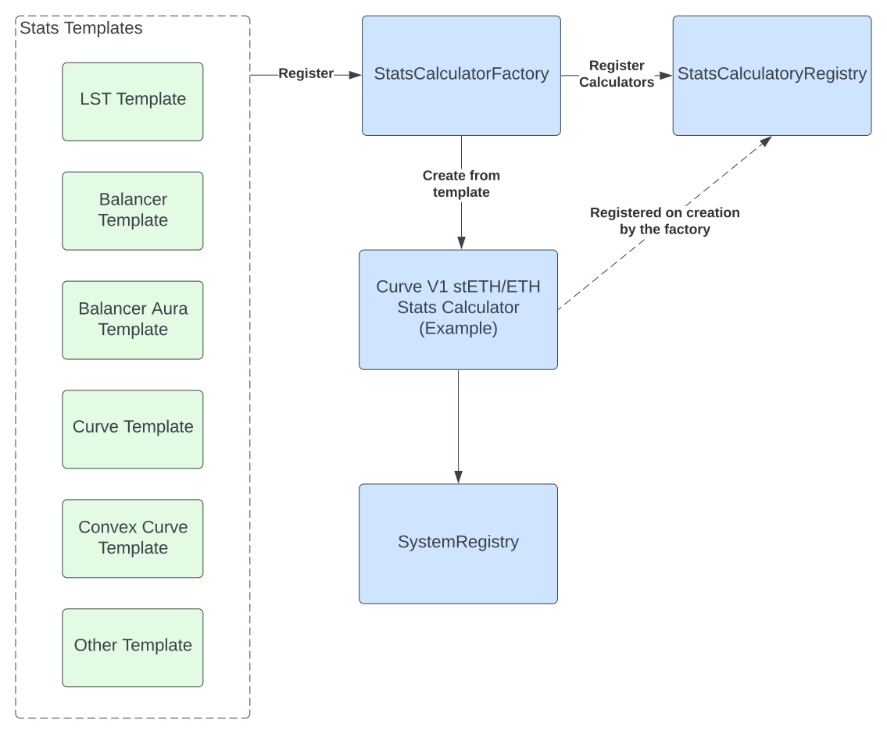
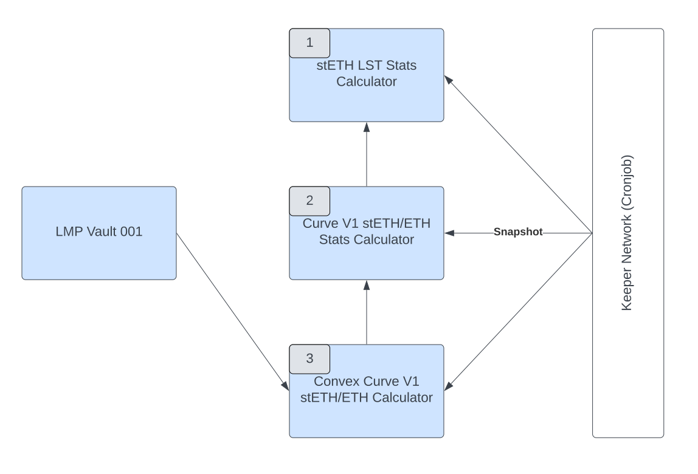

# Stats

The `Stats` contracts and libraries provide aggregated and consistent statistics for
the destinations for Tokemak's LMPs. This allows all LMPs to use the same
data when making rebalancing decisions.

## Architecture

The diagram below provides the high-level architecture for the stats system

-   Templates are created for each unique type of entity that needs to be tracked. For example, LSTs (stETH, rETH), DEXs (Curve, Balancer, Maverick), Staking (Convex, Aura)
-   The templates are registered with the `StatsCalculatorFactory`
-   Concrete contracts for specific entities (e.g., Curve V1 stETH/ETH pool) are created by the `StatsCalculatorFactory`
-   Each concrete calculator has a unique `AprId` that is registered at the `StatsCalculatorRegistry` by the factory
-   The registry and AprId is used by the LMP and other calculators to find relevant stats contracts (more detail on this below)

## 

The purpose of the calculators is to store, augment, and clean data relevant for the LMPs. Each calculator must be snapshot by a keeper to stay up to date.

The following section provides details on how calculators are used and maintained after being created by the factory.
A `Convex Curve stETH/ETH` pool is used as an example, but the general logic applies to all calculators.

In this example, there are three stats calculators. Each adds additional stats relevant for the LMP to make rebalancing decisions.

1. stETH LST Stats Calculator: provides stats on the base LST, such as base yield, slashing events, price-to-book value
2. Curve V1 stETH/ETH Stats Calculator: provides stats on the DEX, primarily trading fees
3. Convex Curve V1 stETH/ETH Stats Calculator: provides additional incentive yields

LMP Vaults read the highest-level stats calculator, in this case the Convex/Curve calculator, that provides a complete rollup of the information from the three calculators.
Each calculator has a `current` method that the LMP calls.

A keeper network is used to periodically snapshot new data. Each calculator type defines the frequency and conditions under which a snapshot should be taken.
Importantly, each calculator only stores the required information to provide its stats. If it needs to provide stats from another calculator,
those are read at the time of the request to ensure that data is consistent.
